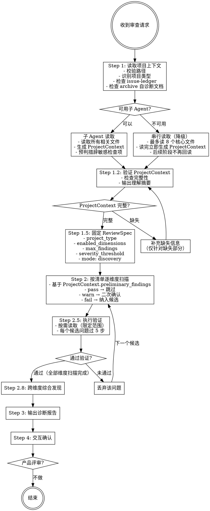

# 模式 A：详细流程和结构定义

> 本文件包含 mode-a.md 中的详细流程图和 ProjectContext 结构定义，按需加载。

---

## 详细流程图



---

## ProjectContext 结构定义

子 Agent 读取后输出的结构化结果，主线程后续阶段基于此工作，不再回读原文件。

```yaml
project_type: skill | claude_md | mcp_server
entry_file: "SKILL.md"

# 文件清单 — 每个文件一行摘要
files:
  - path: "references/mode-a.md"
    role: "审阅模式流程定义"
    key_points: "5步验证、Iron Law、流程图循环"

# 核心工作流 — 从输入到输出的主路径
workflow:
  input: "用户输入描述"
  steps:
    - "Step 1: 做什么"
    - "Step 2: 做什么"
  output: "最终输出描述"

# 关键判断节点 — 影响分支走向的条件
decision_points:
  - condition: "判断条件"
    branches: "条件A → 路径X | 条件B → 路径Y"

# 已知约束 — 项目明确声明的限制
constraints:
  - "约束描述"

# 预判结果 — 子 Agent 对措辞敏感检查项的预判
preliminary_findings:
  - dimension: "指令层"
    check_item: "无歧义表述"
    status: pass  # pass | warn | fail
    evidence: "判断依据说明"
    # 以下仅 warn/fail 时填写
    quote: "相关原文"
    location: "文件:行号"
```

---

## preliminary_findings 预判规则

子 Agent 对以下措辞敏感检查项做预判：

| 检查项 | 预判方法 | status 判定 |
|--------|---------|------------|
| 无歧义表述 | 搜索"看情况"、"可能"、"一般来说"、"原则上"等模糊词 | 有模糊词且无补充说明 → warn；有模糊词且影响核心逻辑 → fail |
| 约束具体 | 检查输出格式、边界条件是否有具体定义（字段名、类型、示例） | 只有模糊描述 → warn；关键约束缺失 → fail |
| 触发条件明确 | 检查是否有 if/when 判断条件 | 只有自然语言描述无条件判断 → warn |
| 优先级明确 | 检查多条指令是否有冲突可能 | 存在潜在冲突无优先级规则 → warn |

**预判格式要求**：
- `status: pass` — 无问题，主线程跳过
- `status: warn` — 有疑问，主线程需二次确认
- `status: fail` — 明确问题，主线程直接纳入候选
- `evidence` — 一句话说明判断依据
- `quote` — 相关原文（仅 warn/fail）
- `location` — 文件:行号（仅 warn/fail）

---

## 子 Agent 任务定义

```
你的任务是读取目标项目并生成 ProjectContext 结构化结果。

1. 读取项目中所有相关文件（SKILL.md、CLAUDE.md、reference 文件、配置文件等）
2. 生成 ProjectContext，包含：
   - project_type: 项目类型
   - entry_file: 入口文件
   - files: 文件清单（路径 + 职责 + 关键点）
   - workflow: 核心工作流（输入 → 步骤 → 输出）
   - decision_points: 关键判断节点
   - constraints: 已知约束
3. 对以下措辞敏感检查项做预判，写入 preliminary_findings：
   - 无歧义表述：搜索"看情况"、"可能"、"一般来说"、"原则上"等模糊词
   - 约束具体：检查输出格式、边界条件是否有具体定义
   - 触发条件明确：检查是否有 if/when 判断条件
   - 优先级明确：检查多条指令是否有冲突可能

预判格式：
- dimension: 维度名称
- check_item: 检查项名称
- status: pass | warn | fail
- evidence: 判断依据（一句话）
- quote: 相关原文（仅 warn/fail）
- location: 文件:行号（仅 warn/fail）
```

---

## 降级策略详细说明

当子 Agent 不可用时（如平台不支持、Agent 工具调用失败），执行以下降级方案：

### 串行读取硬限制

- **最多读 8 个核心文件**（按优先级：入口文件 > 主指令文件 > reference 文件 > 配置文件）
- 读完立即生成 ProjectContext + preliminary_findings
- **后续阶段不再回读**，只用这个结构化结果

### 优先级读取顺序

| 优先级 | 文件类型 | 示例 |
|--------|---------|------|
| 1 | 入口文件 | SKILL.md、CLAUDE.md |
| 2 | 主指令文件 | 定义核心工作流的文件 |
| 3 | reference 文件 | references/*.md |
| 4 | 配置文件 | package.json、mcp.json |
| 5 | 其他 | README、CHANGELOG |

### 上下文保护措施

- 每读完一个文件，立即提取关键信息写入 ProjectContext，不保留原文
- 如果读到第 5 个文件时感觉上下文已接近上限，停止读取，基于已有信息生成 ProjectContext
- preliminary_findings 只对已读文件做预判，未读文件标记为 `status: unknown`

---

## 执行验证详细方法

扫描发现的每个候选问题，在进入报告前必须通过执行验证。**不过验证的问题不得进入报告。**

**按需读取规则**（避免上下文膨胀）：

- 只读问题涉及的文件（通常 1-2 个），不得扇出到其他文件
- 用 `location` 字段（文件:行号）定位相关段落，只读该段落及上下文（前后各 10 行）
- 如果需要读取的文件在 ProjectContext.files 中不存在，说明子 Agent 遗漏，此时才补充读取

**验证方法**——对每个候选问题执行以下检查（按顺序，命中任一淘汰条件即丢弃）：

1. **读完上下文**：找到问题涉及的所有相关段落（不只是引文所在的段落），通读完整上下文。如果其他段落有补充说明、例外条款或分级规则使逻辑自洽，淘汰该问题。
   - 淘汰条件：完整上下文读完后，逻辑自洽，不存在矛盾。

2. **模拟执行**：用一个具体输入走完整执行路径，观察实际行为是否与问题描述一致。
   - 淘汰条件：模拟执行后发现问题描述的行为不会实际发生（如 hook 有兜底、脚本有降级路径）。

3. **区分层次**：确认问题是功能逻辑 bug，还是工具覆盖度/文档表述精度/设计决策偏好。
   - 淘汰条件：问题本质是工具层缺口、文档表述精度或设计决策，而非功能逻辑错误。

4. **区分概念与实现**：如果问题涉及"概念定义"与"实际实现"的差异，确认实现是否为概念的合理近似，以及是否有明确的优先级规则（如"脚本先判，LLM 兜底"）。
   - 淘汰条件：实现是概念的合理近似，且有明确优先级规则。

5. **走完逻辑链**：对于涉及条件判断、计数、状态转换的问题，必须模拟完整的状态流转，不能只看中间一步。
   - 淘汰条件：完整状态流转后逻辑自洽。

每个候选问题必须附上验证过程摘要，格式：
```
验证过程：
- 读完上下文：[简述完整上下文如何影响判断]
- 模拟执行：[用什么输入走的，实际输出是什么]
- 层次判定：[为什么是/不是功能逻辑 bug]
- 逻辑链：[完整状态流转]
结论：保留 / 淘汰（原因）
```

**反模式清单（命中任一即高度怀疑该问题是误报）**：
- 两处文档说同一件事但措辞不同 → 先找有没有补充说明、例外条款或分级规则
- 概念定义和实际脚本行为有差异 → 先确认"脚本是实现、概念是框架"的架构
- 报告的是工具覆盖度问题而非功能逻辑 → 降级为工具层问题或淘汰
- 只看了引文所在段落没读完整上下文 → 必须通读相关文件的完整章节
- 没有用具体输入模拟过执行路径 → 不得报告为 P0/P1
