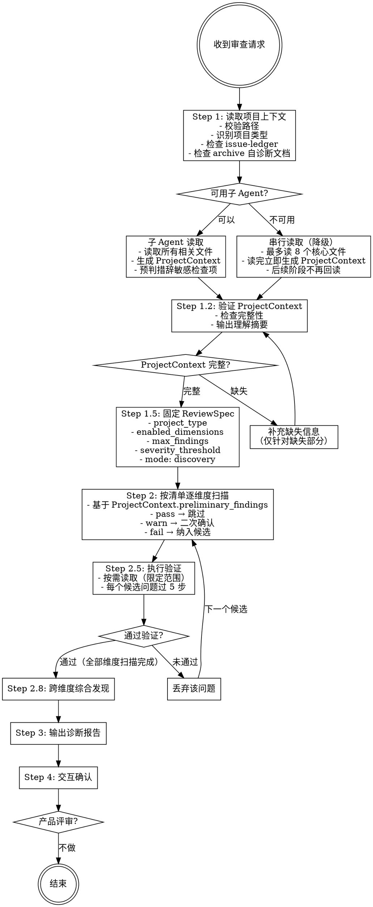

# 模式 A：审阅 [Rigid]

验证步骤不可跳过、不可 adapt、不可"看情况"简化。

## Iron Law

```
NO ISSUE REPORT WITHOUT EXECUTION VERIFICATION FIRST
```

如果一个候选问题没有通过 5 步验证（读完上下文、模拟执行、区分层次、区分概念与实现、走完逻辑链），它不得进入报告。

## Red Flags — 审查阶段

| 想法 | 现实 |
|------|------|
| "这个太明显了不用验证" | 越明显越要模拟执行 |
| "我之前见过这个问题" | 每个项目上下文不同，必须重新验证 |
| "这个是 P2 不用报告" | P2 进 backlog，但必须记录 |
| "用户应该知道这个" | 用户不知道，报告它 |
| "读了引文就够了" | 必须通读完整上下文 |
| "这个改动很小不会有连锁影响" | L3 引用检查必须跑 |

## 流程图



## ProjectContext 结构定义

子 Agent 读取后输出的结构化结果，主线程后续阶段基于此工作，不再回读原文件。

```yaml
project_type: skill | claude_md | mcp_server
entry_file: "SKILL.md"

# 文件清单 — 每个文件一行摘要
files:
  - path: "references/mode-a.md"
    role: "审阅模式流程定义"
    key_points: "5步验证、Iron Law、流程图循环"

# 核心工作流 — 从输入到输出的主路径
workflow:
  input: "用户输入描述"
  steps:
    - "Step 1: 做什么"
    - "Step 2: 做什么"
  output: "最终输出描述"

# 关键判断节点 — 影响分支走向的条件
decision_points:
  - condition: "判断条件"
    branches: "条件A → 路径X | 条件B → 路径Y"

# 已知约束 — 项目明确声明的限制
constraints:
  - "约束描述"

# 预判结果 — 子 Agent 对措辞敏感检查项的预判
preliminary_findings:
  - dimension: "指令层"
    check_item: "无歧义表述"
    status: pass  # pass | warn | fail
    evidence: "判断依据说明"
    # 以下仅 warn/fail 时填写
    quote: "相关原文"
    location: "文件:行号"
```

### preliminary_findings 预判规则

子 Agent 对以下措辞敏感检查项做预判：

| 检查项 | 预判方法 | status 判定 |
|--------|---------|------------|
| 无歧义表述 | 搜索"看情况"、"可能"、"一般来说"、"原则上"等模糊词 | 有模糊词且无补充说明 → warn；有模糊词且影响核心逻辑 → fail |
| 约束具体 | 检查输出格式、边界条件是否有具体定义（字段名、类型、示例） | 只有模糊描述 → warn；关键约束缺失 → fail |
| 触发条件明确 | 检查是否有 if/when 判断条件 | 只有自然语言描述无条件判断 → warn |
| 优先级明确 | 检查多条指令是否有冲突可能 | 存在潜在冲突无优先级规则 → warn |

**预判格式要求**：
- `status: pass` — 无问题，主线程跳过
- `status: warn` — 有疑问，主线程需二次确认
- `status: fail` — 明确问题，主线程直接纳入候选
- `evidence` — 一句话说明判断依据
- `quote` — 相关原文（仅 warn/fail）
- `location` — 文件:行号（仅 warn/fail）

## 阶段一：技术审查（发现模式，必跑）

### Step 1: 读取项目上下文

- 若未指定路径，使用 AskUserQuestion 给用户两个选项：1）审查当前项目 2）输入具体项目路径
- 校验目标路径：目录是否存在（不存在则告知用户并追问正确路径）、是否为空、是否有可识别的配置文件（SKILL.md、CLAUDE.md、package.json 等）
- 识别项目类型（按优先级）：存在 SKILL.md → 按 skill 审查；存在 MCP server 配置（如 mcp.json、server.ts）→ 按 MCP server 审查；存在 CLAUDE.md → 按 CLAUDE.md 审查；都没有 → 追问用户确认项目类型。同时存在多种类型文件时，以主要指令文件为准，其他文件作为上下文参考
- 若存在 [issue-ledger.md](issue-ledger.md)，先读取历史 issue 状态；已 `fixed` / `rejected` 的问题不得重复报告，`deferred` 问题只能进入 backlog
- 检查项目的 `references/archive/` 目录（或类似的历史文档目录）是否存在自诊断文档、历史审查报告或改进分析文档。若有，先读取并纳入扫描上下文——审查目标从"从零发现问题"调整为"验证项目自诊断是否准确、改进方案是否已落地"
- 若项目内容不足以进行有意义的审查（如只有配置文件、无实际指令/工具定义），告知用户并建议先补充内容

#### Step 1.1: 子 Agent 读取（推荐）或串行读取（降级）

**优先使用子 Agent 读取**，将读取任务委托给独立的子 Agent，避免主线程上下文膨胀。

**子 Agent 任务定义**：

```
你的任务是读取目标项目并生成 ProjectContext 结构化结果。

1. 读取项目中所有相关文件（SKILL.md、CLAUDE.md、reference 文件、配置文件等）
2. 生成 ProjectContext，包含：
   - project_type: 项目类型
   - entry_file: 入口文件
   - files: 文件清单（路径 + 职责 + 关键点）
   - workflow: 核心工作流（输入 → 步骤 → 输出）
   - decision_points: 关键判断节点
   - constraints: 已知约束
3. 对以下措辞敏感检查项做预判，写入 preliminary_findings：
   - 无歧义表述：搜索"看情况"、"可能"、"一般来说"、"原则上"等模糊词
   - 约束具体：检查输出格式、边界条件是否有具体定义
   - 触发条件明确：检查是否有 if/when 判断条件
   - 优先级明确：检查多条指令是否有冲突可能

预判格式：
- dimension: 维度名称
- check_item: 检查项名称
- status: pass | warn | fail
- evidence: 判断依据（一句话）
- quote: 相关原文（仅 warn/fail）
- location: 文件:行号（仅 warn/fail）
```

**子 Agent 不可用时**，执行串行读取（见"降级策略"）。

### Step 1.2: 验证 ProjectContext（必须完成才能进入扫描）

不再要求"通读所有文件"，而是验证子 Agent 输出的 ProjectContext 是否完整。

**验证清单**：

- [ ] `project_type` 已填写且正确
- [ ] `files` 列表覆盖了项目的核心文件（至少包含入口文件和主要指令文件）
- [ ] `workflow` 描述了从输入到输出的完整路径
- [ ] `decision_points` 覆盖了主要分支节点
- [ ] `constraints` 列出了项目明确声明的限制
- [ ] `preliminary_findings` 已填写，且对 warn/fail 项提供了 evidence 和 quote

**输出理解摘要**（从 ProjectContext 提取）：

- 这个 agent 是干嘛的（一句话）
- 核心工作流（2-4 步）
- 关键文件和各自职责
- 主要的判断/分支节点

如果 ProjectContext 不完整（如缺失关键字段、preliminary_findings 为空），说明子 Agent 读取不充分，**仅针对缺失部分**补充读取，不得重新读取已有内容。

理解摘要不进入审查报告，它是扫描的内部前置条件。

### Step 1.5: 固定 ReviewSpec

- 在扫描前生成本轮 `ReviewSpec`，并在报告开头展示
- `ReviewSpec` 至少包含：
  - `project_type`
  - `enabled_dimensions`
  - `excluded_dimensions`
  - `max_findings`（默认 8）
  - `severity_threshold`（默认 P1，表示 P0/P1 阻塞）
  - `checklist_version`
  - `mode: discovery`
- 同一轮修复和验证必须沿用该 `ReviewSpec`
- 若用户要求扩大范围，必须开始新一轮审查，而不是混入当前修复闭环

### Step 2: 按清单逐维度扫描

基于 `ProjectContext.preliminary_findings` 做扫描，**不再回读原文件**。

**扫描规则**：

| preliminary_findings.status | 处理方式 |
|---------------------------|---------|
| `pass` | 跳过，不纳入候选问题 |
| `warn` | 二次确认：基于 evidence 和 quote 判断是否为真实问题。确认为问题 → 纳入候选；确认无问题 → 标记为 pass 并跳过 |
| `fail` | 直接纳入候选问题 |

**扫描流程**：

1. 加载 [checklist.md](checklist.md) 中的审查清单
2. 按"各类型审查重点"映射表确定本次必检/选检维度，不适用的跳过
3. 遍历 `preliminary_findings`，按上述规则处理
4. 对于 checklist 中有但 `preliminary_findings` 未覆盖的检查项（非措辞敏感项），基于 ProjectContext 的其他字段（workflow、decision_points、constraints）做判断
5. 每扫描完一个维度，输出简短进度提示（如"指令层完成，发现 2 个 P0/P1 问题"）
6. 每轮最多输出 `ReviewSpec.max_findings` 个问题，优先级为 P0 > P1 > P2 > P3
7. 若 P0/P1 已达到上限，停止输出 P2/P3

### Step 2.5: 执行验证（每个候选问题必过）

扫描发现的每个候选问题，在进入报告前必须通过执行验证。**不过验证的问题不得进入报告。**

**按需读取规则**（避免上下文膨胀）：

- 只读问题涉及的文件（通常 1-2 个），不得扇出到其他文件
- 用 `location` 字段（文件:行号）定位相关段落，只读该段落及上下文（前后各 10 行）
- 如果需要读取的文件在 ProjectContext.files 中不存在，说明子 Agent 遗漏，此时才补充读取

**验证方法**——对每个候选问题执行以下检查（按顺序，命中任一淘汰条件即丢弃）：

1. **读完上下文**：找到问题涉及的所有相关段落（不只是引文所在的段落），通读完整上下文。如果其他段落有补充说明、例外条款或分级规则使逻辑自洽，淘汰该问题。
   - 淘汰条件：完整上下文读完后，逻辑自洽，不存在矛盾。

2. **模拟执行**：用一个具体输入走完整执行路径，观察实际行为是否与问题描述一致。
   - 淘汰条件：模拟执行后发现问题描述的行为不会实际发生（如 hook 有兜底、脚本有降级路径）。

3. **区分层次**：确认问题是功能逻辑 bug，还是工具覆盖度/文档表述精度/设计决策偏好。
   - 淘汰条件：问题本质是工具层缺口、文档表述精度或设计决策，而非功能逻辑错误。

4. **区分概念与实现**：如果问题涉及"概念定义"与"实际实现"的差异，确认实现是否为概念的合理近似，以及是否有明确的优先级规则（如"脚本先判，LLM 兜底"）。
   - 淘汰条件：实现是概念的合理近似，且有明确优先级规则。

5. **走完逻辑链**：对于涉及条件判断、计数、状态转换的问题，必须模拟完整的状态流转，不能只看中间一步。
   - 淘汰条件：完整状态流转后逻辑自洽。

每个候选问题必须附上验证过程摘要，格式：
```
验证过程：
- 读完上下文：[简述完整上下文如何影响判断]
- 模拟执行：[用什么输入走的，实际输出是什么]
- 层次判定：[为什么是/不是功能逻辑 bug]
- 逻辑链：[完整状态流转]
结论：保留 / 淘汰（原因）
```

**反模式清单（命中任一即高度怀疑该问题是误报）**：
- 两处文档说同一件事但措辞不同 → 先找有没有补充说明、例外条款或分级规则
- 概念定义和实际脚本行为有差异 → 先确认"脚本是实现、概念是框架"的架构
- 报告的是工具覆盖度问题而非功能逻辑 → 降级为工具层问题或淘汰
- 只看了引文所在段落没读完整上下文 → 必须通读相关文件的完整章节
- 没有用具体输入模拟过执行路径 → 不得报告为 P0/P1

### Step 2.8: 跨维度综合发现（写报告前的整体思考）

在所有维度扫描完成、执行验证通过后，输出诊断报告之前，花一段文字回答以下三个问题。这不是产品评审的"目标治理综合分析"（那是阶段二的事），而是对技术审查发现的**整体校验**：

1. **这些发现之间有没有共同根因？** 例如：维度 3 发现的 workflow bug 和维度 9 发现的过程控制/目标治理失衡，可能共享同一个根因——"规则覆盖了正向路径，但异常路径有缝隙"。如果找到了共同根因，在报告的每个相关 finding 中互相引用（如"APM-WORKFLOW-008 与 APM-GOV-005 共享根因，见产品评审综合分析"）

2. **有没有一个发现修复后能让其他发现自然消失或降级？** 例如：修复了 APM-GOV-001（引入 Rubric），APM-GOV-005（过程控制/目标治理失衡）的严重程度可能从 P1 降为 P3，因为目标治理规则自然增加了

3. **有没有与项目自诊断文档（Step 1 中读取的 archive 材料）不一致的地方？** 如果项目自诊断已经发现了某问题并提出了方案，但审查发现该方案存在缺陷或遗漏，必须在报告中显式标注

输出格式：不进入报告正文，但作为报告的引言段或审查小结的一部分呈现，2-4 句话即可。

### Step 3: 输出诊断报告

报告格式见 [report-templates.md](report-templates.md) 的"技术审查报告"模板。

### Step 4: 交互确认

- 输出完整审查报告后，询问用户："要逐个确认并修改吗？"
- 用户确认后，逐个问题与用户确认："我看到 X，你觉得这个是问题吗？"
- 用户确认的给出修改建议或直接改代码，不确认的跳过，不强推
- 用户选择不逐个确认的，报告到此结束
- **交互确认完成后，若存在 `accepted` 的 P0/P1，先进入模式 B 修复阶段；若无待修复阻塞项，则直接进入产品评审询问**
- 用户确认的问题标记为 `accepted`；用户拒绝的问题标记为 `rejected`；未处理的 P2/P3 标记为 `deferred`
- 只有 `accepted` 的 P0/P1 默认进入修复模式

## 降级策略

当子 Agent 不可用时（如平台不支持、Agent 工具调用失败），执行以下降级方案：

### 串行读取硬限制

- **最多读 8 个核心文件**（按优先级：入口文件 > 主指令文件 > reference 文件 > 配置文件）
- 读完立即生成 ProjectContext + preliminary_findings
- **后续阶段不再回读**，只用这个结构化结果

### 优先级读取顺序

| 优先级 | 文件类型 | 示例 |
|--------|---------|------|
| 1 | 入口文件 | SKILL.md、CLAUDE.md |
| 2 | 主指令文件 | 定义核心工作流的文件 |
| 3 | reference 文件 | references/*.md |
| 4 | 配置文件 | package.json、mcp.json |
| 5 | 其他 | README、CHANGELOG |

### 上下文保护措施

- 每读完一个文件，立即提取关键信息写入 ProjectContext，不保留原文
- 如果读到第 5 个文件时感觉上下文已接近上限，停止读取，基于已有信息生成 ProjectContext
- preliminary_findings 只对已读文件做预判，未读文件标记为 `status: unknown`

## 阶段二：产品评审（技术审查闭环结束后询问是否继续）

触发时机：
- 若没有进入模式 B：技术审查交互确认完成后立即询问用户："技术审查完成，要继续做产品评审吗？"
- 若进入了模式 B：待修复验证完成、台账更新完成后，再询问用户："修复验证完成，要继续做产品评审吗？"

- 用户确认后，执行以下步骤
- 用户拒绝时输出"技术审查完成，如需产品评审随时说"或"修复验证完成，如需产品评审随时说"，自然结束

**产品评审步骤**：

1. **价值评定（三方评估法）**：先按 report-templates.md 的三方评估法执行——扮演支持方列出优点、扮演反方列出缺点、综合双方观点给出客观评级。然后基于三方评估中的具体证据，按 5 个维度（痛度、技术质量、差异化、ROI、Loop 成熟度）的量化 Rubric 评分
2. **目标治理综合分析**（必出）：不是列问题清单，而是从整体上回答——
   - 过程控制 vs 目标治理的张力在哪？统计两类规则的数量和比例
   - 最有杠杆的改进方向是什么？补哪一项能让其他项自然改善？
   - 改进项之间的依赖关系是什么？哪些必须同步实施？
3. **发展方向**：输出短/中/长期路线图草案
4. **用户接受策略**：定位 + 行动清单

产品评审模板见 [report-templates.md](report-templates.md) 的"产品评审"模板。
