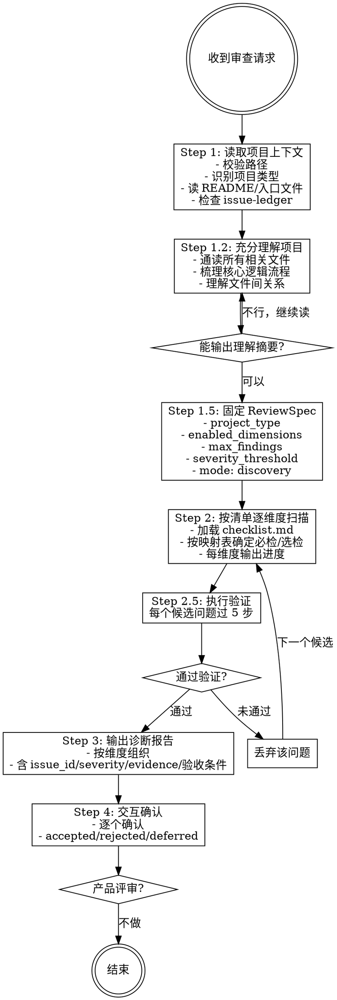

# 模式 A：审阅 [Rigid]

验证步骤不可跳过、不可 adapt、不可"看情况"简化。

## Iron Law

```
NO ISSUE REPORT WITHOUT EXECUTION VERIFICATION FIRST
```

如果一个候选问题没有通过 5 步验证（读完上下文、模拟执行、区分层次、区分概念与实现、走完逻辑链），它不得进入报告。

## Red Flags — 审查阶段

| 想法 | 现实 |
|------|------|
| "这个太明显了不用验证" | 越明显越要模拟执行 |
| "我之前见过这个问题" | 每个项目上下文不同，必须重新验证 |
| "这个是 P2 不用报告" | P2 进 backlog，但必须记录 |
| "用户应该知道这个" | 用户不知道，报告它 |
| "读了引文就够了" | 必须通读完整上下文 |
| "这个改动很小不会有连锁影响" | L3 引用检查必须跑 |

## 流程图



## 阶段一：技术审查（发现模式，必跑）

### Step 1: 读取项目上下文

- 若未指定路径，使用 AskUserQuestion 给用户两个选项：1）审查当前项目 2）输入具体项目路径
- 校验目标路径：目录是否存在（不存在则告知用户并追问正确路径）、是否为空、是否有可识别的配置文件（SKILL.md、CLAUDE.md、package.json 等）
- 识别项目类型（按优先级）：存在 SKILL.md → 按 skill 审查；存在 MCP server 配置（如 mcp.json、server.ts）→ 按 MCP server 审查；存在 CLAUDE.md → 按 CLAUDE.md 审查；都没有 → 追问用户确认项目类型。同时存在多种类型文件时，以主要指令文件为准，其他文件作为上下文参考
- 读取目标目录下的 README、入口文件、主配置文件
- 若存在 [issue-ledger.md](issue-ledger.md)，先读取历史 issue 状态；已 `fixed` / `rejected` 的问题不得重复报告，`deferred` 问题只能进入 backlog
- 理解"这个 agent 是干嘛的"——没有上下文的审查是脱离实际的
- 有 README 则读取理解上下文；无 README 则从项目文件中自行推断用途，推断不了再追问用户
- 若项目内容不足以进行有意义的审查（如只有配置文件、无实际指令/工具定义），告知用户并建议先补充内容

### Step 1.2: 充分理解项目（必须完成才能进入扫描）

在固定 ReviewSpec 之前，必须先充分理解项目。不是"读了"，而是"理解了"。

- 通读项目中所有相关文件（SKILL.md、CLAUDE.md、reference 文件、配置文件等），不止是入口文件
- 梳理核心逻辑流程：从用户输入到最终输出，经过哪些步骤、哪些判断、哪些分支
- 理解文件间的关系：主文件和 reference 文件如何配合，哪些内容在哪个文件中定义
- 输出一段 3-5 行的"项目理解摘要"，包含：
  - 这个 agent 是干嘛的（一句话）
  - 核心工作流（2-4 步）
  - 关键文件和各自职责
  - 主要的判断/分支节点
- 如果无法输出理解摘要，说明读得不够，不得进入扫描
- 理解摘要不进入审查报告，它是扫描的内部前置条件

### Step 1.5: 固定 ReviewSpec

- 在扫描前生成本轮 `ReviewSpec`，并在报告开头展示
- `ReviewSpec` 至少包含：
  - `project_type`
  - `enabled_dimensions`
  - `excluded_dimensions`
  - `max_findings`（默认 8）
  - `severity_threshold`（默认 P1，表示 P0/P1 阻塞）
  - `checklist_version`
  - `mode: discovery`
- 同一轮修复和验证必须沿用该 `ReviewSpec`
- 若用户要求扩大范围，必须开始新一轮审查，而不是混入当前修复闭环

### Step 2: 按清单逐维度扫描

- 加载 [checklist.md](checklist.md) 中的审查清单
- 按"各类型审查重点"映射表确定本次必检/选检维度，不适用的跳过
- 默认必检：指令层、工作流层、逻辑正确性、设计质量
- 按需检查：工具层（MCP server 必检，其他选检）、输出层、用户交互层、最佳实践
- 每扫描完一个维度，输出简短进度提示（如"指令层完成，发现 2 个 P0/P1 问题"）
- 每轮最多输出 `ReviewSpec.max_findings` 个问题，优先级为 P0 > P1 > P2 > P3
- 若 P0/P1 已达到上限，停止输出 P2/P3

### Step 2.5: 执行验证（每个候选问题必过）

扫描发现的每个候选问题，在进入报告前必须通过执行验证。**不过验证的问题不得进入报告。**

验证方法——对每个候选问题执行以下检查（按顺序，命中任一淘汰条件即丢弃）：

1. **读完上下文**：找到问题涉及的所有相关段落（不只是引文所在的段落），通读完整上下文。如果其他段落有补充说明、例外条款或分级规则使逻辑自洽，淘汰该问题。
   - 淘汰条件：完整上下文读完后，逻辑自洽，不存在矛盾。

2. **模拟执行**：用一个具体输入走完整执行路径，观察实际行为是否与问题描述一致。
   - 淘汰条件：模拟执行后发现问题描述的行为不会实际发生（如 hook 有兜底、脚本有降级路径）。

3. **区分层次**：确认问题是功能逻辑 bug，还是工具覆盖度/文档表述精度/设计决策偏好。
   - 淘汰条件：问题本质是工具层缺口、文档表述精度或设计决策，而非功能逻辑错误。

4. **区分概念与实现**：如果问题涉及"概念定义"与"实际实现"的差异，确认实现是否为概念的合理近似，以及是否有明确的优先级规则（如"脚本先判，LLM 兜底"）。
   - 淘汰条件：实现是概念的合理近似，且有明确优先级规则。

5. **走完逻辑链**：对于涉及条件判断、计数、状态转换的问题，必须模拟完整的状态流转，不能只看中间一步。
   - 淘汰条件：完整状态流转后逻辑自洽。

每个候选问题必须附上验证过程摘要，格式：
```
验证过程：
- 读完上下文：[简述完整上下文如何影响判断]
- 模拟执行：[用什么输入走的，实际输出是什么]
- 层次判定：[为什么是/不是功能逻辑 bug]
- 逻辑链：[完整状态流转]
结论：保留 / 淘汰（原因）
```

**反模式清单（命中任一即高度怀疑该问题是误报）**：
- 两处文档说同一件事但措辞不同 → 先找有没有补充说明、例外条款或分级规则
- 概念定义和实际脚本行为有差异 → 先确认"脚本是实现、概念是框架"的架构
- 报告的是工具覆盖度问题而非功能逻辑 → 降级为工具层问题或淘汰
- 只看了引文所在段落没读完整上下文 → 必须通读相关文件的完整章节
- 没有用具体输入模拟过执行路径 → 不得报告为 P0/P1

### Step 3: 输出诊断报告

报告格式见 [report-templates.md](report-templates.md) 的"技术审查报告"模板。

### Step 4: 交互确认

- 输出完整审查报告后，询问用户："要逐个确认并修改吗？"
- 用户确认后，逐个问题与用户确认："我看到 X，你觉得这个是问题吗？"
- 用户确认的给出修改建议或直接改代码，不确认的跳过，不强推
- 用户选择不逐个确认的，报告到此结束
- **交互确认完成后，自动进入模式 B 修复阶段的询问**
- 用户确认的问题标记为 `accepted`；用户拒绝的问题标记为 `rejected`；未处理的 P2/P3 标记为 `deferred`
- 只有 `accepted` 的 P0/P1 默认进入修复模式

## 阶段二：产品评审（技术审查交互确认后询问是否继续）

技术审查交互确认完成后，询问用户："技术审查完成，要继续做产品评审吗？"

- 用户确认后，执行以下步骤
- 用户拒绝时输出"技术审查完成，如需产品评审随时说"，自然结束

产品评审模板见 [report-templates.md](report-templates.md) 的"产品评审"模板。
