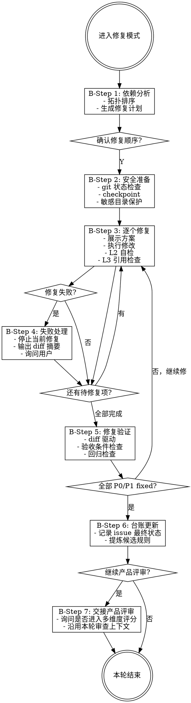

# 模式 B：修复 [Rigid]

安全检查和验证步骤不可跳过、不可 adapt、不可"看情况"简化。

## Iron Law

```
NO FIX APPLIED WITHOUT VERIFICATION EVIDENCE FIRST
```

修复后必须跑验收条件确认通过，不得凭感觉宣布"应该没问题了"。

## Red Flags — 修复阶段

| 想法 | 现实 |
|------|------|
| "改完应该没问题了" | 跑验收条件，不要猜 |
| "这个改动很小不用检查引用" | L3 引用检查必须跑 |
| "跳过验证这次应该 OK" | 没有"这次"，每次都验证 |
| "这个文件不会被其他地方引用" | 扫描确认，不要假设 |
| "回滚太麻烦了直接覆盖" | 禁止破坏性操作，先问用户 |
| "用户说全部修复我就一口气改完" | 每个修复仍需 L2 自检 |

## 流程图



## B-Step 1: 依赖分析与修复计划

- 分析所有 `accepted` 问题之间的依赖关系（如"修 A 需要先修 B"）
- 按拓扑排序生成修复顺序
- 每个修复项必须带上发现模式中生成的 `issue_id` 和 `acceptance_criteria`
- 展示修复计划（模板见 [report-templates.md](report-templates.md) 的"修复计划"模板）
- 用户可调整顺序或跳过某些问题
- 用户说"全部修复"时，进入连续修复模式（见下方）

### 连续修复模式

用户选择"全部修复"后，连续执行所有 `accepted` 问题，不再逐个询问确认。只在以下情况暂停：

1. **修复失败** — 文件修改失败、格式破坏等
2. **发现 P0/P1 回归** — L2 自检发现本次修改引入了新问题
3. **L3 引用检查命中** — 需要用户决定是否同步更新引用文件

每个修复项仍需执行完整的 L2 自检和 L3 引用检查，只是不再等待用户确认。

## B-Step 2: 安全准备

修复开始前：
1. 检查项目是否为 git 仓库（不是则警告用户无法记录完整 git diff，询问是否继续）
2. 检查工作区是否有用户未提交改动；若有，必须在修复计划中标明，不得覆盖
3. 优先创建非破坏性 checkpoint（如记录当前 `git diff` 摘要或创建临时 patch）；不得自动执行破坏性回滚命令
4. 识别敏感目录（node_modules、.env、dist、build、__pycache__、.git 等），标记为只读保护区
5. 展示安全状态："已记录修复前状态，敏感目录已保护"

禁止在未获得用户明确确认时执行 `git reset --hard`、`git checkout --`、强制覆盖、删除文件等破坏性操作。

## B-Step 3: 逐个修复

对每个待修复问题：

**3a. 展示修复方案**
```
正在修复 APM-WORKFLOW-001: [问题描述]

涉及文件：
- /path/to/file1.md（第 X-Y 行）
- /path/to/file2.ts（第 A-B 行）

验收条件：
- [条件 1]
- [条件 2]

修复内容：
[展示具体修改内容/代码片段]
```

**3b. 确认或批量**
- 默认：等待用户确认 (Y/n/跳过)
- 若用户已选择"全部修复"：进入连续修复模式，自动执行，不再询问

**3c. 执行修复**
- 修改前再次检查目标文件是否在只读保护区，是则跳过并警告
- 执行修改
- 代码文件修改时展示完整 diff（类似 git diff 格式）
- 修改后将该问题状态临时标记为 `fixed_pending_verification`

**3d. L2 自检（依赖链感知）**
修复完成后，自动检查：
- 本次修改是否满足该问题的 `acceptance_criteria`
- 本次修改是否与项目中其他文件/指令产生直接矛盾
- 本次修改是否影响了其他待修复问题的前提条件
- 若发现冲突，立即报告并建议调整后续修复计划

**3e. L3 轻量引用检查**
修复完成后，扫描项目中是否有其他文件引用了本次修改的内容：
- 找到引用 → 提示用户："以下文件也引用了刚修改的内容，需要同步更新吗？"
- 未找到引用 → 继续下一个

## B-Step 4: 修复失败处理

若修复过程中出错（文件修改失败、格式破坏等）：
1. 立即停止当前修复
2. 不得自动破坏性回滚；输出失败前后的 diff 摘要和建议恢复方式
3. 报告失败原因："修复 APM-WORKFLOW-001 失败，未自动回滚。失败原因：..."
4. 询问用户："要按建议恢复、跳过这个问题，还是继续修复其他问题？"

## B-Step 5: 修复验证

所有修复完成后，自动执行验证：

**5a. 进入验证模式**
- 验证模式沿用本轮 `ReviewSpec`，但设置 `mode: verification`
- 验证模式不得重新执行完整开放式审查
- 验证范围只包括：
  1. `accepted` 问题的 `acceptance_criteria` 是否满足
  2. 本次 diff 是否引入直接矛盾、危险操作、主流程断裂等 P0/P1 回归
  3. 本次 diff 是否破坏其他待修复问题的前提条件
- 验证模式不得新增 unrelated P2/P3 问题
- 如果发现 unrelated 问题，只能记录到 backlog，不能阻塞本轮结束

**5b. 差异审查**
- 读取本轮修复产生的 diff
- 对每个 `accepted` issue 逐项验证：
  - diff 是否覆盖该问题的证据位置
  - diff 是否满足验收条件
  - diff 是否引入直接冲突
- 输出验证报告（模板见 [report-templates.md](report-templates.md) 的"修复验证报告"模板）

**5c. 停止条件**
- 若所有 `accepted` 的 P0/P1 都为 `fixed`，且无本次 diff 直接引入的 P0/P1 回归：进入 B-Step 6 收尾，并按需要交接到产品评审
- 若存在 `partially_fixed` 或 `failed` 的 P0/P1：只针对这些 issue 继续修复，不得重新开放完整审查
- 若用户要求处理 backlog：开启新一轮审查或新一轮修复，不混入当前闭环

**5d. 格式检查**
- Markdown 文件：检查语法完整性
- JSON 文件：检查合法性
- 代码文件：基础语法检查（如有 linter 则运行）

## B-Step 6: 台账与进化记录

修复完成后，先更新问题台账，再检查是否有新的可提炼规则（参考进化机制）：
- 将本轮所有 issue 的最终状态记录到 [issue-ledger.md](issue-ledger.md)
- 若修复过程中发现新的通用模式 → 只记录为候选规则，不得直接写入正式 checklist
- 若使用了 checklist 中的修复模板 → 标记该模板在本项目中验证通过
- 候选规则不得在当前审查闭环内生效，只能在用户确认后的下一轮审查中启用

## B-Step 7: 产品评审交接

当本轮修复源自模式 A 的技术审查闭环时，B-Step 6 完成后不得直接结束，必须显式询问用户：

`修复验证完成，要继续做产品评审吗？`

- 用户确认：进入 [report-templates.md](report-templates.md) 的"产品评审"模板，继续输出多维度评分、发展方向和用户接受策略
- 用户拒绝：输出"修复验证完成，如需产品评审随时说"，然后结束
- 若本轮是用户单独发起的纯修复请求（不是从模式 A 进入），可跳过此步，直接结束
