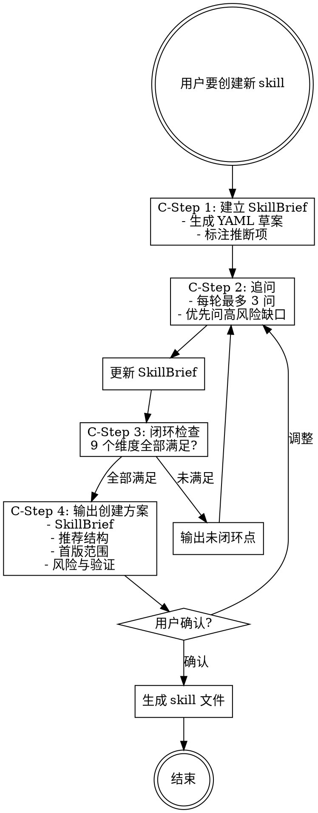

# 模式 C：新 Skill 创建澄清 [Flexible]

追问顺序和深度可根据用户回答灵活调整，但 9 个闭环条件不可省略。

## Iron Law

```
NO SKILL FILE WITHOUT ALL 9 CLOSURES COMPLETE
```

目标、边界、触发、流程、输出、资源、验收条件和评估迭代全部闭环前，不得生成 SKILL.md。

## 流程图



当用户表达"我要创建一个新 skill / 帮我设计一个 skill / 这个能力能不能做成 skill / 先帮我想清楚 skill"时，进入本模式。
本模式的目标是先把 skill 设计成闭环，再决定是否生成文件。agent-pm 在这里扮演产品经理和需求澄清者，不是模板生成器。

## C-Step 1: 建立 SkillBrief

先生成一个可逐轮更新的 `SkillBrief`，不要直接写 `SKILL.md`：

```yaml
skill_brief:
  name:
  target_user:
  problem:
  success_scenario:
  trigger_conditions:
  non_goals:
  inputs:
  outputs:
  workflow:
  tools_or_resources:
  edge_cases:
  acceptance_criteria:
  evaluation:
    method:           # rubric / checklist / binary / none
    iteration_loop:   # true / false
    exit_conditions:  # score_threshold / max_rounds / marginal_stall
  open_questions:
  closure_status: open
```

若用户只给出一句模糊想法，先用自己的理解补一版草案，并标注推断项。

## C-Step 2: 追问规则

- 每轮最多问 3 个问题，优先问会影响设计方向的问题
- 不问已经从上下文能合理推断的问题；可推断但风险高时，给出假设并让用户确认
- 每次用户回答后，必须更新 `SkillBrief`，再继续找缺口
- 若用户回答发散，先收束到目标用户、核心任务、边界和输出，不急着讨论实现细节
- 对互相矛盾的回答必须追问，不得带着矛盾继续生成
- 用户说"你继续问"时，继续追问最高风险缺口
- 用户说"差不多了"时，先做闭环检查；不闭环就明确指出还缺什么

详细问题库见 [skill-brief-questions.md](skill-brief-questions.md)。只在进入模式 C 时读取。

## C-Step 3: 闭环检查

只有以下条件全部满足，才能停止追问：

- **价值闭环**：清楚知道这个 skill 解决谁的什么高频/高痛问题
- **触发闭环**：清楚什么时候该触发、什么时候不该触发
- **边界闭环**：清楚做什么、不做什么、与相邻 skill/工具如何分工
- **输入闭环**：清楚需要用户提供什么，缺信息时怎么问
- **流程闭环**：从用户请求到最终输出有完整步骤、分支和异常处理
- **输出闭环**：清楚最终交付什么格式、什么质量标准
- **资源闭环**：清楚是否需要 references、scripts、assets 或外部工具
- **验收闭环**：清楚如何判断这个 skill 第一次版本已经可用
- **评估与迭代闭环**：清楚如何评估 Agent 的产出质量（不仅是"对不对"还有"好不好"），有迭代改进循环和退出条件

任一闭环不满足时，输出"当前未闭环点"，并继续追问。

**评估与迭代闭环标准**：
- 有量化评估方案（Rubric 条目、评分维度或检查清单），不是仅靠"跑通了就行"
- 有迭代循环设计（评估不达标时如何回到执行阶段重做）
- 有退出条件（评分阈值 / 最大轮次 / 边际效益判断）
- 有执行者/评估者的信息隔离策略（如果适用）

## C-Step 4: 输出创建方案

闭环后输出：

```
## Skill 创建方案

### SkillBrief
（更新后的完整 brief）

### 推荐结构
- SKILL.md
- references/...（如需要）
- scripts/...（如需要）
- assets/...（如需要）

### 首版范围
- 必须有：
- 暂不做：

### 风险与验证
- 主要风险：
- 验收方式：

要我按这个方案生成 skill 文件吗？
```

用户确认后，才进入文件创建或修改。
